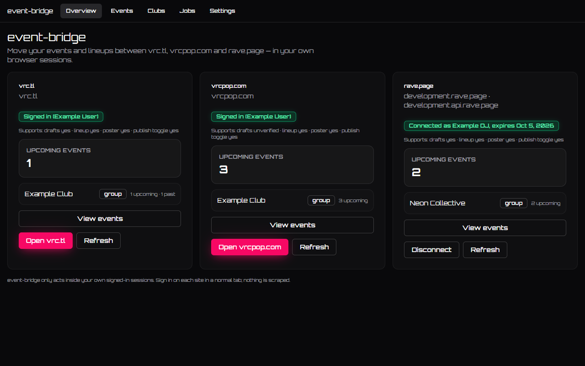
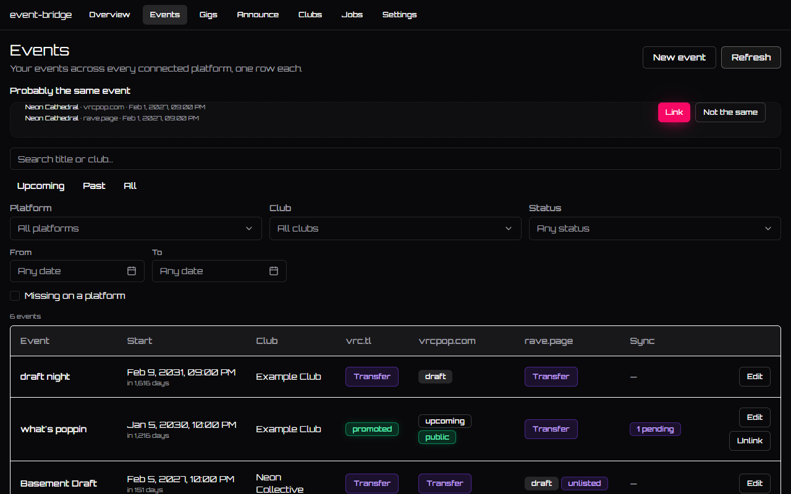
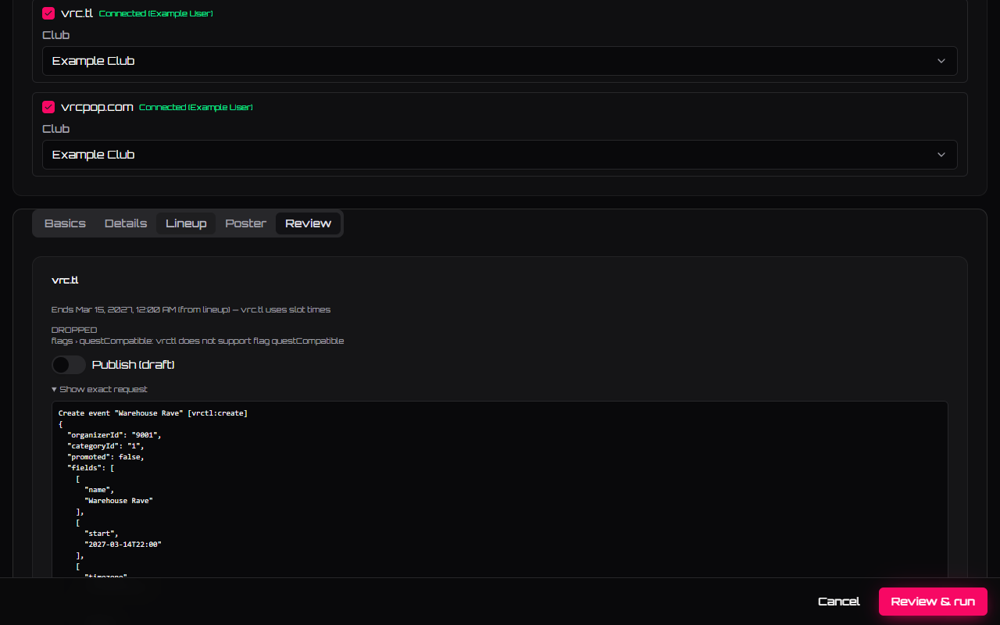
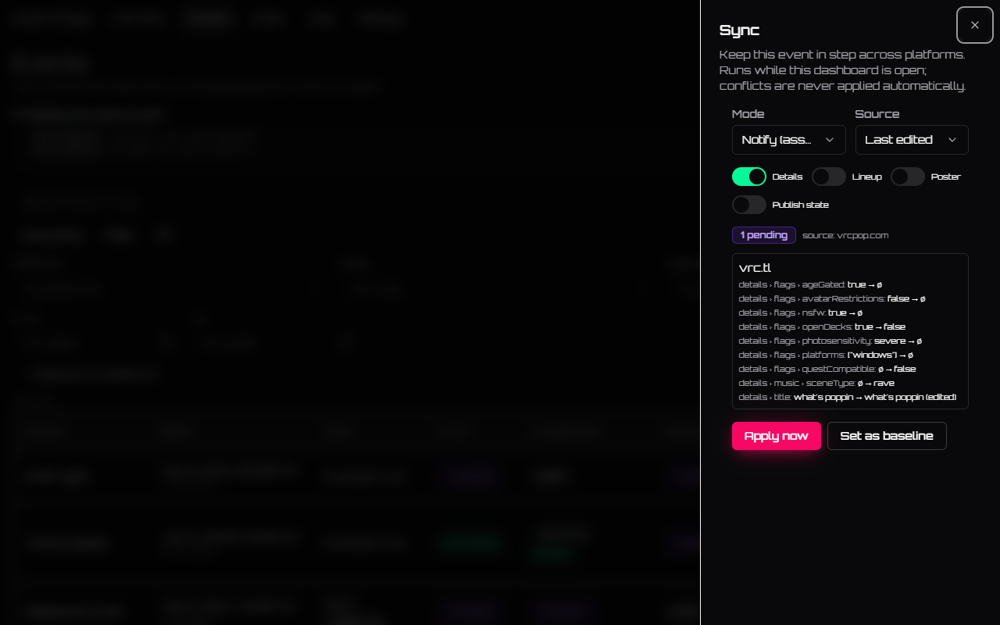

# event-bridge

A browser extension that lets you create, edit, transfer and keep VRChat scene
events in sync across [vrc.tl](https://vrc.tl), [vrcpop.com](https://vrcpop.com)
and [rave.page](https://rave.page) — from one dashboard.

## What it is, and why

VRChat events live on three separate platforms that don't talk to each other.
If you run a club night, you probably post the same event — title, date, lineup,
poster — two or three times, once per platform, by hand. There's no shared API,
so keeping the copies in step is manual too.

event-bridge is a browser extension that does that from one place. It acts as
**you**, in **your** browser, using **your** logged-in sessions — the same
actions you'd take by hand, only entered once. It touches your own clubs and
your own events, nothing else. There's no event-bridge server and no account to
make: everything runs locally in your browser.

## Screenshots



*Overview — one equal card per platform (vrc.tl, vrcpop.com, rave.page): connection status, your clubs, upcoming counts.*



*Events — one row per event across platforms, with cross-platform link suggestions, per-cell Transfer, and a live Sync badge.*



*Editor · Review — the exact request per target, the derived "Ends …" time, and what each platform can't carry.*



*Sync sheet — review the changed fields on a linked event and apply them to the other platform.*

More: [docs/screenshots](docs/screenshots/) — all captures come from the mocked test platforms, not real accounts.

## Install

There are **no store listings yet** — you install it unpacked (developer mode).
Two ways to get the files:

- **Download a [release zip](https://github.com/dymattic/event-bridge/releases)** and unzip it, or
- **Build from source:** install [Node 22+](https://nodejs.org) and
  [pnpm 10+](https://pnpm.io), then in the project folder run
  `pnpm install && pnpm build`. That writes `dist/chrome` and `dist/firefox`.

### Chrome / Chromium / Edge / Brave

1. Open `chrome://extensions` (Edge: `edge://extensions`; Brave:
   `brave://extensions`).
2. Turn on **Developer mode** (top-right toggle).
3. Click **Load unpacked** and pick the `dist/chrome` folder (or the folder you
   unzipped from a release).
4. Pin the event-bridge icon to the toolbar so you can find it.

### Firefox

1. Open `about:debugging#/runtime/this-firefox`.
2. Click **Load Temporary Add-on…** and pick `dist/firefox/manifest.json`.
3. Open the extension and **grant site access** when the popup asks.

On Firefox this is a **temporary** add-on: it disappears when you restart the
browser, and stays that way until there's a signed build. You reload it the same
way after each restart.

## Use it

1. **Sign in** to the platforms you use, in that same browser (event-bridge
   never asks for your passwords — you log in on each platform yourself).
2. Click the toolbar icon to open the **dashboard**.

What you'll find:

- **Overview** — one card per platform: whether you're connected, your clubs,
  and your upcoming events. Everything is shown by name — clubs and events read
  as titles and dates, never raw ids.
- **Events** — one row per event, with a cell for each platform. Where a copy
  exists you see its status; where it's missing on a platform you use, a
  one-click **Transfer** creates it there. **Edit** opens the event; event-bridge
  also suggests "probably the same event" for look-alike copies so you can link
  them into one row.
- **My gigs** — see your upcoming gigs across platforms by entering your DJ name;
  export them as an `.ics` calendar.
- **Announce** — copy Discord-ready announcements with live `<t:…>` timestamps,
  your lineup and links to every platform, from presets you design.
- **Creating an event** — enter it once: title, start time, lineup, flags,
  genres, links and poster, and tick the platforms to post it to. **Only the
  start time is required** — the end follows your lineup (or a default length you
  set). Events are **drafts by default**; publishing is an explicit per-target
  switch with a red confirm before anything goes public.
- **Lineup + poster** — build the lineup with drag-and-drop slots and searchable
  performers; set a poster by URL or by picking a file.
- **Sync** — for a linked event, keep its copies in step. Per link you choose a
  mode (**off**, **notify**, or **apply**), a **source** (last-edited, or a fixed
  platform), and which **fields** sync. **Conflicts are never applied
  automatically** — a field changed on both sides waits for your pick. Sync runs
  only while the dashboard is open, never on a timer or in the background.
- **Jobs** — a step-by-step log of everything the extension sent, so you can see
  exactly what it did. Stored locally; clear it anytime.
- **Settings** — your default event length and your sync defaults.
- **Clubs** — link the same club across platforms (clubs that share a VRChat
  group link automatically).

Before any write, event-bridge shows you the **exact request** it will send and
what each platform can and can't represent, and it stops at the first error
instead of pushing on.

## Experimental: rave.page

The rave.page integration is **off by default**. vrc.tl and vrcpop.com work
fully without it. Turn it on under **Settings → Experimental** and rave.page
joins as a third, equal integration.

rave.page is on its way to an open-source, federated release, so the **instance is
configurable**:
point event-bridge at any self-hosted or federated rave.page by setting the app
origin and API origin in Settings (your browser prompts once for access to the
new host). The development instance is the default for contributors — it is
never required to use event-bridge.

## What it never does

- **No scraping, no crawling.** It only does what you could do by hand in your
  own browser, at human speed.
- **No public listings, no other people's events.** It reads and writes your own
  clubs and events only.
- **No background activity.** No timers, no polling, no telemetry. It acts only
  when you tell it to, and only while the dashboard is open.
- **Nothing leaves your browser** except the requests to the platforms you're
  signed in to. There's no event-bridge server.
- **Drafts by default**, and **every write is previewed exactly** before it's
  sent. It never publishes on your behalf.

See [docs/privacy.md](docs/privacy.md) for exactly what's stored and where.

## Help wanted

This is an open-source project and contributions are welcome.

### Development

```sh
pnpm install     # Node 22+, pnpm 10+
pnpm dev         # rebuild on change
pnpm test        # unit tests (vitest)
pnpm e2e         # end-to-end tests (Playwright; first run: pnpm exec playwright install chromium)
```

Before a commit, the gates must be green:

```sh
pnpm check:pins && pnpm typecheck && pnpm test && pnpm build && pnpm e2e && pnpm lint:firefox
```

A few house rules worth knowing up front (full detail in
[CLAUDE.md](CLAUDE.md) and [docs/development.md](docs/development.md)):

- **Dependencies are pinned exact and must be at least 7 days old**, each with a
  row in [SUPPLY_CHAIN.md](SUPPLY_CHAIN.md). Prefer zero new dependencies.
- **Own events only, never scraping** — features that automate beyond your own
  clubs/events are out of scope.
- **Test fixtures are sanitized** — no real ids, tokens or hostnames in the repo
  (see [test/fixtures/README.md](test/fixtures/README.md)).

### Bug reports

Please include:

- your browser and version, and which platform the problem is on;
- the relevant step from the **Jobs** view (the request preview) — **with ids
  redacted**;
- any console errors.

**Never paste tokens, cookies or CSRF values** — event-bridge never records them,
and they should never end up in an issue.

### Adding a platform provider

New platforms are welcome as long as they follow the same user-agency,
own-events-only, no-scraping rule. Start here:

- the adapter contract — [`src/adapters/types.ts`](src/adapters/types.ts);
- routes are an **allowlist** (own surfaces only, no public-listing endpoints);
- the capability table — [`src/core/capabilities.ts`](src/core/capabilities.ts)
  and the [capability matrix](docs/platforms/capabilities.md);
- fixture rules — [test/fixtures/README.md](test/fixtures/README.md).

A rough checklist for a new adapter:

1. **capabilities** — describe what the platform can represent (`CAPS`).
2. **routes** — the allowlist of own-surface endpoints.
3. **parse / plan / execute** — read the platform's data into the core schema,
   build the request plan, execute it.
4. **fixtures** — sanitized captures + goldens for the parse/map tests.
5. **e2e mock** — a mocked platform so tests never touch the real site.

## Independent project

event-bridge is an independent, open-source tool (WTFPL). It is **not affiliated
with, endorsed by, or a product of** vrc.tl, vrcpop.com or rave.page — the three
are equal integrations, and no platform account is a prerequisite: connect only
the platforms you use. It's built with rave.page's design-system kit
`@rave-page/ui` (MIT, vendored until it is published) and shares that look by
design.

Status: pre-alpha, under construction.

## License

[WTFPL](LICENSE).
